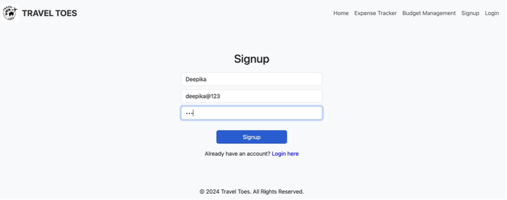
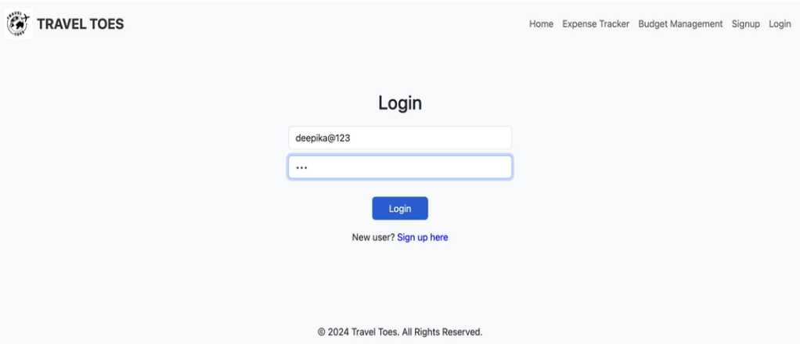
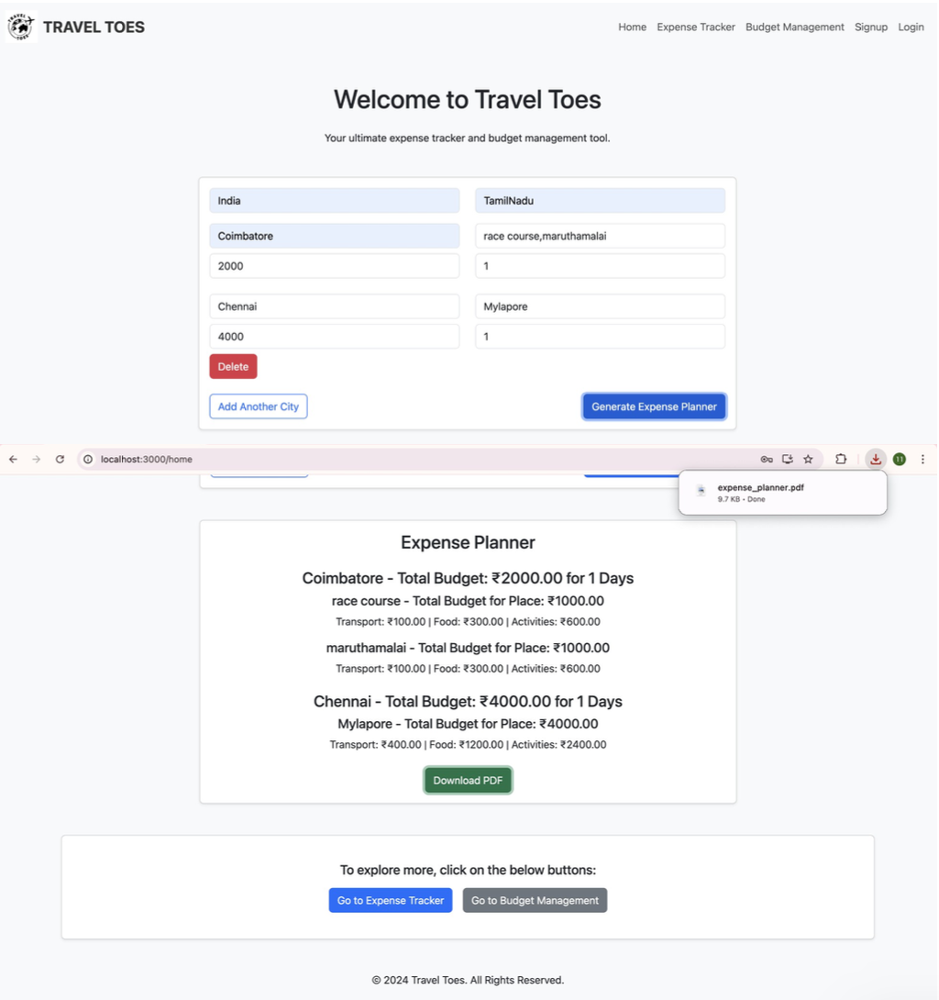
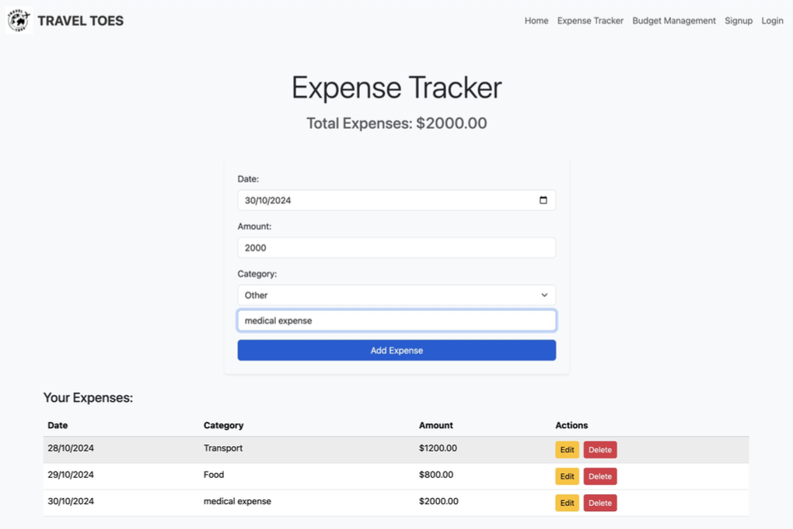
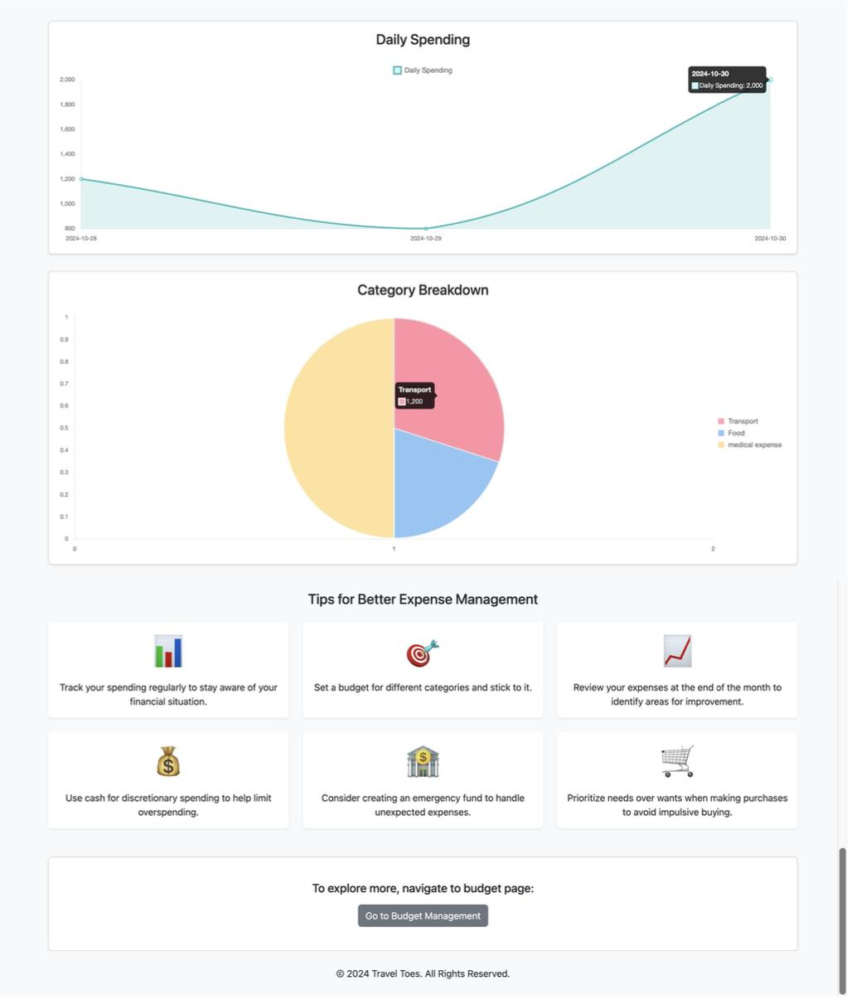
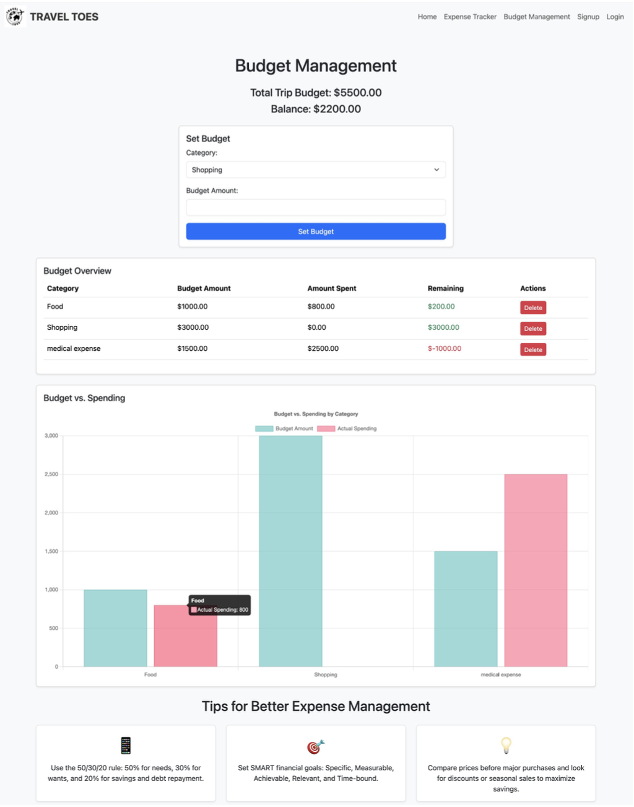
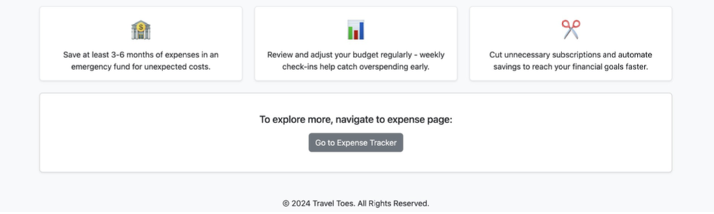

# 📌 Travel Toes – A Travel Expense Manager

## 📝 Abstract

**Travel Toes** is a travel expense management application that helps users plan and track travel budgets with ease. Key features include:

- User-friendly login and signup
- Input travel destination, budget, duration
- Log daily expenses and categorize them
- Visualize expenses via charts
- Monitor remaining budget with progress bars
- Receive tips for smarter budgeting

---

## 📦 Modules with Features

### 1. 🔐 User Authentication
- **Login** with email and password
- **Signup** with name, email, and password

### 2. 💸 Expense Tracking
- Add, edit, delete expenses
- View total expenses

### 3. 🎯 Budget Management
- Set budgets by category
- View breakdown and remaining budget
- Delete budgets

### 4. 🧾 Expense Planner
- Enter country, state, cities, places, total budget & days
- Auto-calculate per-day and per-category budgets

### 5. 📥 Downloadable Reports
- Export detailed city/place-wise expense reports in PDF

### 6. 📊 Visualization
- **Line Chart**: Daily spend trend
- **Pie Chart**: Category-wise distribution

### 7. 💡 Budget Tips
- Tips based on user behavior

### 8. 🚨 Budget Alerts
- Visual alert when spending nears limits

---

## 🛠️ Technologies Used

### Frontend
- **React.js**
- **HTML**, **CSS**
- **React Router**

### Backend
- **Node.js**, **Express.js**
- **JWT** (for secure login)

### Database
- **MongoDB**, **Mongoose**

### Charts & Reports
- **Chart.js**
- **jsPDF** (for PDF generation)

### Version Control
- **Git**

---

## 🧩 Database Schemas

### `User.js`
```js
const userSchema = new mongoose.Schema({
  fullName: { type: String, required: true },
  email: { type: String, required: true, unique: true },
  password: { type: String, required: true }
});
```

### `Expense.js`
```js
const expenseSchema = new mongoose.Schema({
  userId: { type: mongoose.Schema.Types.ObjectId, ref: 'User', required: true },
  date: { type: String, required: true },
  category: { type: String, required: true },
  amount: { type: Number, required: true }
});
```

### `Budget.js`
```js
const budgetSchema = new mongoose.Schema({
  userId: { type: mongoose.Schema.Types.ObjectId, ref: 'User', required: true },
  category: { type: String, required: true },
  amount: { type: Number, required: true }
});
```

---

## 🖼️ GUI Screenshots

### 🔑 SignUp Page  


### 🔓 Login Page  


### 🏠 Home Page  


### 📊 Expense Tracker Page  
  


### 💰 Budget Management  
  


---

## ✅ Conclusion

- Travel Toes simplifies budget planning and expense tracking.
- Combines UI clarity with technical power (React, Node, MongoDB).
- Future enhancements: Multi-currency support & predictive analytics.

---
